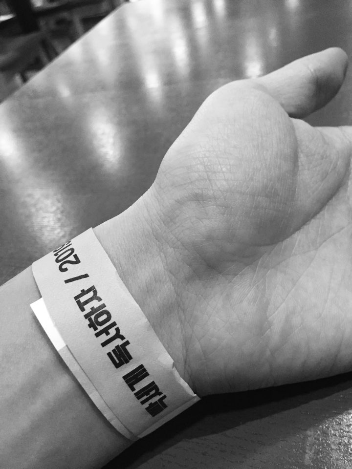

'갓'대교가 후원하고 체인지 그라운드가 주관하는 **"빡독"** 행사를 3번째 신청에 운이 좋게 당첨되어 오늘 다녀왔습니다.

저번에 빡독 행사에 지원자가 2000명이 넘었다고 들었는데, 이번에는 2200여명 정도라고 합니다. 스피치 하고싶은 분은 스피치도 신청하실 수 있는데, 스피치를 신청해야 당첨 확률이 더 높아집니다. 스피치 신청도 하지 않았는데, 당첨되어서 운이 정말 좋았습니다.

체인지 그라운드에서는 "빡독" 외에도 다른 오프라인 행사들을 주최하는데, 아래 링크를 참조하시면 간단하게 정보를 얻으실 수 있습니다.

[https://www.youtube.com/watch?v=ZwohyKzk-LA](https://www.youtube.com/watch?v=ZwohyKzk-LA)

---

대교 타워 1층 로비에 있는 엄청 높은 책꽂이입니다. 물론 제일 위에서부터 3번째까지는 진짜 책은 아닙니다.

이 기억과 감동이 서서히 사라지기 전에 제가 느꼈던 점을 제 의식의 흐름대로 적어보려고 합니다.

우선, 대한민국 국민의 문해력을 높이는 프로젝트이므로 온전히 책을 읽을 수 있는 시간을 가질 수 있어 좋았습니다. 총 **5시간 반**정도 독서를 하였습니다. 아마 "빡독" 스케줄 상으로는 다 합하면 5시간 45분이었던 것으로 기억합니다. 저는 다독을 하는 사람은 아니지만 그래도 몇년전부터 독서에 관심이 생겨 책을 조금씩 읽기 시작했습니다. 하루에 5 시간 넘게 독서를 해본 경험은 아마 제 인생에서 없었던 것 같은데, 독서에 대한 제 자신의 임계점을 돌파할 수 있어서 의미있었습니다.

제가 평소 생활리듬보다 더 일찍 일어나고, 게다가 **'알고리즘, 인생을 계산하다'**라는 상당히 어려운 책(개발 공부를 하고 있음에도 불구하고 알고리즘 쪽은 지식이 전무합니다...)을 읽기로 정했기에 많이 졸리고 오후에는 책 읽기가 쉽지 않았습니다. 그러나 다수의 사람이 책만 읽고 전혀 딴짓을 하지 않는 환경 설정 속에 있으니까 어떻게든 하게 되더라고요. 중간 중간에 졸음을 쫓기 위해 충분히 휴식을 취해 주면서 나름대로 알차게 독서를 하였습니다.

독서에 대한 임계점을 돌파해보고 싶으신 분들에게 정말 추천드리고 싶은 행사였습니다.

---

외부인들과 구분하기 위해 이젠 이렇게 손목 밴드를 지급한다고 합니다.

그리고 독서 뿐만 아니라 다른 참가자 분들(총 6분)의 스피치도 들을 수 있어서 좋았습니다. 물론, 발표를 잘 하시는 분들도 많았고, 발표를 처음 하셔서 유창하게 하지 못하는 분도 있었습니다. 그러나 발표 스킬이 중요한 것이 아니죠. 발표하신 분들 나름대로 각자의 가치관이나 진정성을 잘 전달해주셔서 정말 좋았습니다.

그 분들 관련해서 개인적인 내용까지 다 언급하기는 그렇지만, 저보다 더 힘든 상황에서 처해있던 분들이 많았다고 느껴져서 저는 느껴지는 바가 많았습니다. 물론, 저는 제가 누려왔고 처해있는 환경을 감사하게 생각하려고 노력하는 편입니다만, 오늘 스피치하셨던 분들 보니까 노력할 필요도 없이 전 제가 이미 누리고 있는 것들을 정말 감사해야한다는 생각이 들었습니다.

저보다 나이가 한참 어린 발표자 분도 있었구요. 제가 저 나이 때 아무 생각 없었던 것을 생각하면 정말 대단하고 제가 배울 점이 많은 친구였습니다. 마지막으로 처음 발표하셨던 분 같은 경우에 저라면 인생 첫 스피치를 이정도 다수의 대중 앞에서 절대 못했을텐데 정말 그 용기는 인정하지 않을 수 없었습니다.

---

사실 저에게 이 행사의 꽃은 신박사님의 스피치였습니다. 고작가님은 컨디션이 안 좋으셔서 말씀하시는 것을 현장에서는 듣지 못했네요. 정말 아쉽습니다. 신박사님도 그렇고 두 분 스케줄이 정말 살인적이실 것을 알기에 조금 더 건강챙기시고 오래 하고자 하시는 일 하셨으면 좋겠습니다.

신박사님은 빡독 시작 전에 스피치를 하셨을 때, 눈물을 보이셨는데요. 저도 모르게 조금 이입이 되어서 눈물이 살짝 맺히기도 했습니다. '세상은 바뀔 수 있다.'라는 주제로 미니 강연을 하셨었는데, 처음에 "빡독" 이벤트를 시작하시게 된 계기 회상하시면서 그리고 이번 행사에 참여자분들이 No-Show를 거의 안하셔서 박사님이 많이 감동을 받으신 것 같습니다. 이번에 5% 이하라고 하시던데, 무료 강연 중에 이정도로 No-Show가 낮은 경우는 없다고 하셨습니다. 앞으로 더 낮아지길 기대해봅니다.

그리고 박사님 개인적으로도 노력하신 만큼 성과가 나오시는 것을 직접 보시니까 더 감동을 받으셨을 것 같습니다. 얼마나 진정성이 있으시고 노력하셨으면 저런 눈물이 나오실까 싶었습니다. 저 또한 제 스스로 노력해서 이룬 떳떳한 성취로 인해 훗날 감동의 눈물을 흘릴 수 있는 사람이 되고 싶다고 많이 느꼈습니다.

박사님은 세상이 바뀔 수 있는 단계를 3가지로 나누셔서 말씀해주셨는데요.

1. 개인 -> 졸꾸러기

2. 조직의 의사결정권자 -> 군부대 대대장님

3. 힘 있는 자본가 -> 신박사님과 빡독 제작에 기여해주신 대교 상무님

저는 단순하게 세상은 개개인이 노력해서 바뀌기 시작하면 바뀔 수 있다는 정도로 생각을 했었는데, 신박사님은 더 세세하게 각 사회 계층 별로 구분해서 말씀해주시는 것이 좋았습니다. 당연히 개인 > 조직의 의사결정권자 > 자본가 순으로 끼칠 수 있는 영향력은 엄청 차이가 납니다. 군부대 대대장님의 경우에는 수백명의 장병들을 통솔하시는 분이시고, 실제로 빡독을 부대 내에서 시행하시는 대대장님이 있다고 들었습니다. 그래서 예시로 넣어봤습니다.

사실 정말 신박사님 그리고 웅이사님으로 부터 좋은 얘기를 많이 들었는데, 이전에 뼈아대, 신박사 tv 등에서 들었던 얘기랑 겹치는 부분도 있고 일일이 정리할 수가 없네요. 다만, 제가 기억에 남는 메시지가 있습니다. 오전 강연도 그렇고, 저녁 QnA 때에도 신박사님은 같은 메시지를 마지막에 던지셨는데 정리하자면 아래와 같습니다. 제 기억에 의존해서 각색한 것이라 정확히 이러한 멘트를 하신 것은 아닙니다.

> *여러분들이 문해력을 높이고 실력을 높이면 그것이 힘, 곧 권력이 될 수 있습니다. 그렇게 대중으로부터 나온 힘이 세상을 충분히 바꿀 수 있습니다. 여러분 졸꾸합시다!!*

신박사, 고작가님을 접한지 1년 6개월 가까이 된 것 같습니다. 실물로 두 분을 뵐 수 있어서 너무 좋았습니다.

그리고 마지막에 줄 서서 사인 받는 분들 다 사라진 이후에 신박사님이 써주신 친필 메시지도 받을 수 있었습니다. 원래 싸인 같은 것 태어나서 누구한테 받아본 적도 없어서(원체 연예인 같은 것에 관심이 없습니다...;;), 생각도 안하다가 받았는데 개인적으로 큰 동기 부여가 될 것이라 믿습니다.

Jolggu!!
