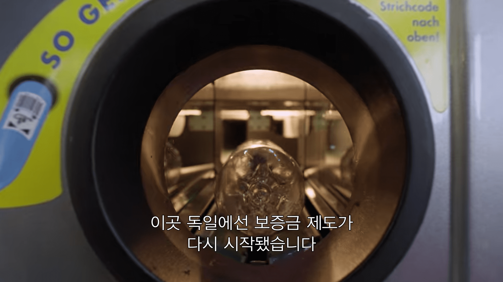

Netflix에 있는 **A PLASTIC OCEAN(플라스틱 바다를 삼키다)**라는 다큐멘터리를 보고 만든 간단한 블로그 포스팅입니다.  <u>인용문 아래 => 화살표 옆에 적힌 부분은 제 생각과 느낀 점 혹은 번역</u>입니다.

---

### 플라스틱 쓰레기로 고통을 겪는 동물들

**미드웨이섬 레이산 앨버트로스 몸에서 나온 플라스틱**

 
 

**플라스틱을 먹이인줄 알고 먹는 거북이**

 
 

### 인류의 플라스틱 사용량

> Worldwide, we use an estimated 1 trillion plastic bags each year -nearly 2 million a minute.

⇒ 매년 1천조, 매분 2백만개의 플라스틱 봉지를 전 세계가 사용하고 있다.

 

### 인간과 동물의 건강에 플라스틱이 끼치는 영향

> 동물이 플라스틱을 먹을 때, 플라스틱에 붙어 있는 유독 물질까지 먹습니다. 그 독소는 혈류로 들어가고 다시 지방 조직과 주요 장기 주변에 축적. 동물이 저장된 지방을 사용할 때 독소는 체내를 순환하고 생식 신진대사 성장 신장과 간의 기능에 영향을 끼친다.

⇒ 시에나 대학 Christina Fossi 교수의 연구 결과에 대해 다루는 파트에서 위 인용문을 발췌했다. 그녀는 지중해 내에 서식하는 긴수염고래의 살점을 채취하여 분석하는데, 긴수염고래 내 프탈레이트 수치가 높은 것으로 확인되었다. 지중해에 사는 고래 내부가 이렇다면 인간을 포함한 모든 생물이 독소를 섭취할 위험이 크다고 그녀는 말한다.

\*\*프탈레이트는 플라스틱을 부드럽게 만드는 데 쓰이는 화학첨가물로 환경호르몬(내분비계 신경물질) 중 하나이다

 
 

### 엄청난 양의 쓰레기에 고통 받는 사람들

**쓰레기 더미를 뒤지는 마닐라의 아이들..**

 
 

**마닐라의 한 매립지 : established in 1998. equivalent to 2000 tennis courts.**

 
=> 다큐멘터리에서는 마닐라의 한 동네에서 엄청난 양의 쓰레기가 제대로 처리되지 못해 무분별하게 땅에 묻혀 있거나 버려져 있는 모습을 보여준다. 아이들은 이런 쓰레기 중 재사용될 만한 것들을 수집해 팔아 생계에 보태고 땅에 묻힌 엄청난 양의 쓰레기를 계속 캐내는 일을 하는 사람도 등장한다. 이러한 일을 하는 사람들은 폐 관련 질병에 많이 걸린다고 한다. 
 
 
=> 내가 살았던 코트디부아르만 해도 이 정도는 아니었지만 하천이나 길거리에 쓰레기가 많이 쌓여있는 것을 쉽게 볼 수 있었다. 그리고 인도 빈민가를 보여주는 유튜브 영상도 본 적이 있었는데 그 동네도 마찬가지였다. 아마도 대부분의 개도국에서 쓰레기 처리 및 재활용 시스템이 제대로 구축이 안 되어 있을 것 같다. 먹고 살기 힘든 상황에서 이러한 문제까지 해결하는 것이 사치일지 모르겠지만... 이러한 쓰레기 문제만 해결되어도 당장 그 쓰레기 더미와 살아가는 사람들의 삶의 질은 상당히 향상되지 않을까 싶다.

 
 
 

</img>

<!--  -->

내가 살았던 아비장(코트디부아르의 수도)에서 흔히 볼 수 있는 풍경

 
 

### 미국 플라스틱 통계

> Plastic packaging for food makes up the majority of municipal waste in America. 80 million tons of waste in America alone, every year, comes from plastic food packaging. That plastic food packaging represents the majority of municipal waste. You will make a positive difference by avoiding single-use and individually packaged items.
>  

> Only 7 percent of plastic waste is recycled in America.

[EPA: US recycled less plastic in 2017 - Plastics Recycling Update](https://resource-recycling.com/plastics/2019/11/21/epa-us-recycled-less-plastic-in-2017/)
 
=> 위 링크에서 통계를 살펴보면 <u>2017년도에 8.4%</u>라고 하니까 다큐에서 공개된 수치와 거의 비슷하다.

 
 

### 독일의 플라스틱 재활용

> 플라스틱병을 슈퍼마켓에 가져가서 이런 기계에 넣으면 바코드를 읽어서 기계는 어떤 플라스틱인지 알 수 있습니다.  
> 재활용할 수 있는 것인지 어떤 소매업자 것인지요.  
> 소비자는 병마다 보증금 25센트를 받고 소매업자가 플라스틱을 가져가서 재활용 처리 업자에게 꽤 많은 돈을 받고 팝니다.

> 이제 독일 거리에서는 이런 플라스특을 거의 볼 수 없죠. 다들 재활용하니까요.

[[세계 녹색 기업을 찾아서 #8] 독일이 재활용률 1위 나라인 이유](https://platum.kr/archives/95305)

=> 위 기사에서도 볼 수 있듯이 독일에서는 정부 차원에서 재활용을 위한 정책을 적극적으로 펼치고 있다. 우리나라에서는 아직까지 국가적인 차원에서 이렇게 적극적으로 하지 않아서 아쉬운 것 같다. 생활폐기물 전체 재활용률이 60%대라고 하지만 실제로 재활용되는 것은 이 수치의 절반도 안된다고 한다. 그래도 민간 시장에서 [오이스터에이블](https://oysterable.com/)과 같은 회사들이 실제로 재활용되는 비율을 높이기 위해 노력하고 있다.

 
 

### 아프리카의 작은 나라 르완다가 펼치는 혁신적인 정책

> Rwanda is one of the very few countries that has banned plastic bags.

⇒ 르완다 같은 아프리카에 있는 작은 나라가 이런 정책을 펼치는 것이 놀라울 따름이다.

 
 

### 플라스틱 은행?!!

> David Katz and Shaun Frankson founded the Plastic Bank. They established a social plastic recycling system in Haiti that exchanges plastic for solar cell phone charging, sustainable cook stoves and cash.

> All of the plastic collected through the Plastic Bank goes through the recycling process and is sold as "social plastic" to be used in manufacturing by values-aligned brands, or it can be used to 3D print.

⇒ 플라스틱을 수집해 재활용시키고 수집해온 사람들에게 각종 방식으로 보상 제공하는 은행이다. 일종의 미시경제 창조하고 있는 것인데, 정말 Cool한 아이디어이고 실행하는 사람들이 너무 멋있어 보인다. 우리나라에도 '사회적 플라스틱'이 널리 재활용되는 날이 오길 기대해본다.

 
 

### 유럽에서 매립되는 플라스틱 통계

In Europe alone, there are 15 million tons of end-of-life plastic going into landfill every year.

 
 

### 플라스틱을 디젤 연료로 전환시키는 기업, Cynar

> Cynar, a waste-to-fuel company, designed a machine that turns end-of-life plastic like candy wrappers and snack packets, which aren't usually recyclable, into diesel.

\*\*Pyrolysis : the application of heat to chemical compounds like plastic to cause decomposition.

 
 

> The whole of the ecosystems of the world are based on a healthy ocean. And if that part of the planet becomes dysfunctional, goes wrong, then the whole of life on this planet will suffer.

said by **David Attenborough**(아래 다큐 만든 할아버지)

[David Attenborough: A Life on Our Planet | Netflix Official Site](https://www.netflix.com/title/80216393)
 
 

> I'll be just as worried about Tilly and Charlie when they're... in their 70s and 80s and I'm long gone. I still want them to be healthy and certainly not suffering the effects of any decisions that I made.

said by **tanya streeter**(a British-Caymanian-American world champion freediver)

⇒ 애틋한 엄마의 마음... 모든 부모가 이런 마음가짐을 갖춘다면 확실히 더 나은 세상이 될 수 있을 것 같다..

 
 
 

## 다큐 마지막 내레이션

I wanna go back to where it all started.

I wanna go back to the whales.

I wanna go and find the juvenile that we first saw.

If whales could talk to us, I imagine they would ask us,

"What were we thinking?"

Every other species on the planet works towards the benefit

of the ecology and environment that it lives in,

but us humans, we just seem like passengers on this earth.

I want to say to the parents of the juvenile,

"I'm sorry. I'm so sorry, on behalf of humanity,

for putting plastic into your home."

And I want to say,

"We'll share this story because from knowing comes caring and from caring comes change."

