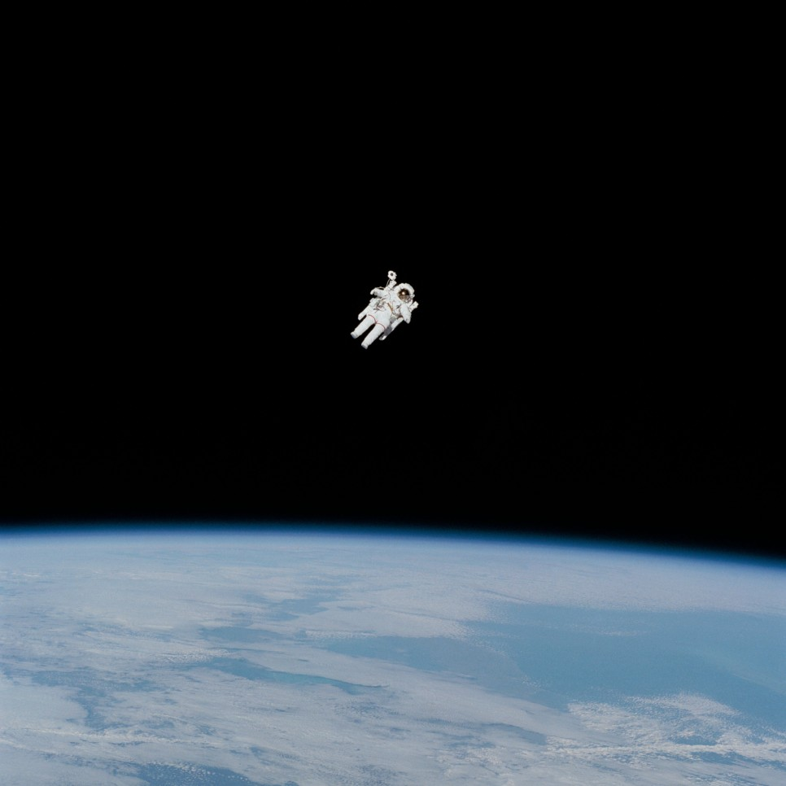

약 700페이지의 책이다. 아마 최근 몇 년간 읽었던 책들중에서 제일 두꺼웠던 책이지 싶다. 서평은 커녕 감상문도 제대로 써본 적이 없어서, 감상문을 써보도록 노력하려 한다. 그런데, 이 책은 너무 모르는 분야라 제대로 이해 못한 디테일도 많았고, 두꺼워서 중간중간에 느낀 점만 조금 끄적여보았다.

150억년 전의 빅뱅, 46억년 전의 지구의 탄생, 그리고 360만년 전에 지구 상에 출현한 인류는 이러한 우리 존재의 시작과 역사를 인식할 줄 아는 존재로 성장했다. 그리고 광막한 우주 공간 속에서 분명히 우리와 다른 생명체도 있을 것이다. 외계 생명체의 시각에서는 우리가 체감하는 인류 사회의 차이가 아무것도 아닌 것으로 보일 것이다. 누군가가 다른 생각을 한다고해서 차별하고 미워하고 하는 일이 정말로 지구 상에서 벌어져서는 안 된다. 우주적 시각으로 보면 모든 존재 하나하나가 소중하다. 우리는 종으로서의 인류를 사랑해야 하며, 우리는 우리를 여기에 있게 해왔고 앞으로도 그렇게 할 코스모스에게 감사해야 할 것이다.

이 사진에서 처럼 직접 지구를 내려다 보는 경험을 해본다면 내가 글로 적고 있는 것들을 더 절실히 느낄 수 있을 것이다. 비행기를 탈 때도 종종 느끼기도 하는 것 같다.

### Part 4 : 천국과 지옥

지구에 충돌할 수 있는 천체들에 대해서 연구하지 않으면 우리는 천체와의 충돌로 인한 현상을 핵실험 같은 것으로 오해하고, 이는 세계 전쟁을 초래할 수도 있다고 한다. 이 책에서 다루는 흐름의 중심에서는 좀 벗어난 얘기 같지만, 인류가 우주를 관찰하고 연구해야할 현실적인 명분인 셈이다.

### Part 7 : 밤하늘의 등뼈

인간이라는 존재, 나라는 존재를 제대로 이해하기 위해서는 자연, 우주, 생명 등 우리 주변을 둘러싸고 있는 것들에 대해 알아보는 것이 좋다고 유시민님이 얘기한 것이 내가 코스모스를 읽게 된 계기 중 하나였다. 이 얘기를 거의 그대로 이 파트의 마지막에서 찾아낼 수 있었다. 고대 이오니아의 과감한 실험과 탐구 정신 그리고 다양한 사고를 받아들이는 문화는 인류 역사에서 약 2000년간 먼지 속에 묻혀있었다.(알렉산드리아에서 과학의 꽃이 다시 펼쳐지긴 했지만)정치 사상을 말할 것도 없고, 종교도 특정 질서를 만들어 사회를 통제, 관리하려는 목적에서 등장했다고 나는 믿고 있다. 크나큰 우주에서 지구가 중심이 아니고, 인간이라는 존재가 특별하지 않다고 생각해버리면 아마 지금보다 덜 복잡하고 투박한 사회 시스템에서 수많은 사람들을 납득시켜 통제하기가 어렵지 않았을까 생각해본다. 그리고 모든 존재는 이기적인 속성을 가지고 있어서, 우리가 발붙이고 사는 지구 그리고 인간이라는 존재가 중심이고 특별하기를 바라는 마음도 우리 깊숙한 곳에 존재하고 있을 것이다. 그러나 앞서 유시민님 말씀처럼 칼 세이건은 말한다. “이러한 인류의 특권의식에 먹칠을 하더라도 코스모스를 제대로 이해해야만 한다. 자신의 위상과 위치에 대한 올바른 이해가 주변을 개선할 수 있는 필수 전제이기 때문이다. 우리와 다른 바깥세상이 어떠한지 알아내는 것도 자신이 처한 상황을 개선하는데 결정적인 도움을 준다.”1000억개가 넘는다는 우주의 은하들 중에 하나의 은하의 중심에서 약 3만 광년 떨어진 곳에 태양계가 위치하고 있다. 이 태양계 안에서 인간들을 지구라는 행성안에 존재하고 있고, 한반도는 미국의 하나의 주보다도 작은데, 두 국가로 갈라져 있는 상황이다. 그 중 하나의 국가의 작지도 크지도 않은 도시 중심부 어딘가의 카페에서 이 책을 읽고 있는 나의 입장에서 우주나 코스모스 같은 것들을 바라보고 생각해보는게 쉽지도 않은 것 같고, 잘 와닿지도 않는 것 같다. 한국의 대도시에서는 사실 별들도 잘 보이지가 않는다. 물론, 모든 인류가 우주에 대해 연구하고 조사할 필요는 없겠지만, 우리가 중심이 아니라 거의 무한에 가깝게 넓은 공간에 존재하고 있는 다양한 생명들 중 하나라는 생각은 우리를 조금 더 겸손하게 만들어주는 것 같다. 이렇게 까지 크게 생각하지 않아도 이러한 사고의 원리는 매우 중요하다고 본다. 내가 아프리카에서 가난하게 사는 사람들, 당장 우리나라에서도 힘들게 사는 많은 사람들과 같은 주변 상황을 생각하지 않는다면 내가 가지고 있는 것을 감사하게 여기지도 않고 이기적인 사람으로만 살게 될 것이다. 사실 저렇게까지 생각할 필요도 없이, 많은 사람들이 우리 주변의 동료, 가족, 친구들 그리고 우리가 발붙이고 사는 동네 정도만 생각해도 우리 사회의 여러 문제들이 해결될 것이라고 생각한다.

### Part 13 : 누가 우리 지구를 대변해 줄까?

어제 양심적 병역 복무제에 관한 방송 프로그램을 우연히 아버지와 시청하며 간단히 얘기를 나눴었다. 우리나라는 지구 상에서 다른 국가들과 다르게 전쟁이 끝난 것이 아니라 중단된 상황이기에 다른 나라들보다는 더 빡세게(?) 군복무를 해야할 필요가 있다고 아버지께서 말씀하셨다. 어릴 때부터 학교에서든 어디든 ‘세계 유일의 분단 국가’라는 타이틀을 귀가 따갑게 들어온 말이다. 안타까운 현실이지만 아버지의 말에 나도 동의하지 않을 수 없다. 그런데 이러한 얘기, 주장들을 접할 때 한편으로 이런 생각도 자주 든다. 국가, 종교, 사상 등 실체도 존재하지 않는 우리 스스로가 만들어낸 것들로 왜 인류는 다투고 갈라서고 해야하는 것인가? 각 국가들의 군비만 전부 절약해서 가난, 환경 보존 등의 지구적인 문제를 해결하기 위해 노력한다면 엄청난 성과가 있을 것이라고 생각한다. 파트 7을 읽으면서 느낀 점과 일맥상통하는데 파트13에서도 저자는 우리에게 조금 더 넓은 시야로 우주적인 관점에서 이러한 문제들을 바라본다. ‘외계에서 우주인들이 지구를 방문한다면, 우리는 현재 지구 곳곳에서 진행 중인 군비 경쟁의 당위성을 그들에게 어떻게 설명할 수 있을까?’ 라고 저자는 질문을 던진다. 이 질문 하나로 군비 경쟁을 지지하고 추진하는 사람들의 논지를 송곳처럼 후벼팔 수 있을 것이다. 지구상에 존재하는 사상, 종교 등을 모르고 매우 다른 시스템에서 살고 있는 외계 지적 생명체에게 그 누가 막힘 없이 군비 경쟁의 당위성을 납득시킬 수 있을까? 아무도 할 수 없을 것이다.그러면 인류는 왜 서로 싸우고 죽이는 전쟁을 계속하고 있을까? 저자는 이러한 인간의 야수성을 인간이 파충류인 시절에 형성됬던 뇌의 R-영역에서 나온 것이라고 말한다. 파충류는 타자와의 교류, 신체 접촉과 같은 행동 양식을 보이지 않기 때문이다. 내가 생각하기에는 포유동물과 달리 파충류는 아마도 다른 생명체를 자신이 먹을 수 있는 대상과 먹을 수 없는 대상으로 보지 않을까 싶다. 파충류는 자신의 새끼를 어떻게 인식할지 모르겠는데, 포유동물처럼 가족들과 무리지어 살지도 않는 것 같다. 포유류는 육체적으로 접촉하며 애정표현을 하는 등 일종의 사회성을 갖추고 있다. 인류도 이러한 특성을 당연히 가지고 있다. 신경심리학자 프레스콧은 유아기에 피부 접촉을 통한 애정 표현이 발달한 문화일수록 폭력성이 덜하다는 연구 결과를 내놓았다. 심리학이나 교육학 등의 책을 많이 읽어보지는 않았지만 충분한 사랑을 받고 자란 아이들이 폭력성이 덜할 것이라는 의견은 많은 사람들이 충분히 동의하지 싶다. 신체 접촉도 애정 표현의 중요한 일부이다. 그래서 칼 세이건은 말한다. **“인류의 미래에 공헌하고 싶은가? 그러면 자신의 아이를 자주 껴안아 주라.”** 크게 보이는 일들도 사실 우리 일상에서 누구나 실천해서 기여할 수 있다는 진리를 다시금 일깨워주었다. 내 주변 사람들에게 베풀고 내 스스로 행복한 사람이 되면, 지구 상의 모든 사람들이 그렇게 된다면 진정한 세계 평화가 가능할 것이다. 우주에 관한 책을 읽으면서 결국 우리 삶을 돌아보게 된다. 지구 밖의 우주나 코스모스에 대해 알아가고 생각해보는 것이 내 삶과 전혀 무관한 것이 아니었던 것이다.