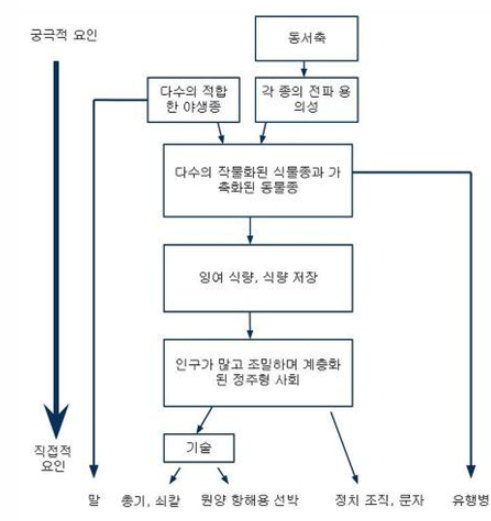

학창 시절 분명 제목은 들어본 책이었다. 서울대에서 추천한 도서 목록이든 입시 논술을 위한 도서 리스트이든 읽어야 하는 좋은 책들 중에 있었던 것으로 기억한다. 옮긴이의 말에서 칼 세이건의 '코스모스'에도 비견할 만하다고 평가하던데, 충분히 동감한다. 둘 다 20세기가 낳은 중요한 과학 도서로 손꼽힐 만한 것들이다.'코스모스'는 우주의 역사와 원리를 다룬다면, **'총, 균, 쇠'는 지구 상의 인류의 역사에 초점이 맞춰져 있다.**

처음 '총, 균, 쇠'라는 책의 제목을 접했을 때, 말 그대로 제목만 접했었고 무슨 내용인지는 몰랐었다. 아마 그 때 알았다고 해도 지금도 초보 독서가인 내가 10대 때 읽으려고 했을리 만무하다. 이 책의 3부 중에 '발명은 필요의 어머니'라는 챕터가 있는데, 발명 뿐만 아니라 독서도 마찬가지인 것 같다. 2년 전 아프리카에서 근무했을 때, 내가 그 동안 봐왔던 수준과는 확연히 다른 수준의 가난한 사회를 볼 수 있었다. 그 이전에 호주나 프랑스에 거주하는 경험을 했었지만 지금 생각해보면 대한민국이라는 나라보다 조금 더 잘 사는 정도였기에 '왜 이들은 우리보다 잘 사는가?'라는 의문을 충분히 강하게 품지는 않았었다.

한반도라는 작은 땅덩어리에서 조선시대에 붕당정치나 예송논쟁 같은 것들로 우리 조상님들은 실질적인 발전을 이룩하지 못 하였고, 그 이후에 식민지배 당하고 6.25 전쟁을 거쳐 단기간에 빠르게 성장해왔다. 그에 비해 유럽 선진국들은 르네상스 이후에 과학혁명 그리고 산업 혁명을 거쳐 기술적으로 그리고 정치적으로도 이미 앞서나갔고 우리나라보다 훨씬 더 긴 시간을 거쳐 발전해왔기에 우리보다 지금 잘 사는 거라고 이 정도 생각만 했던 것 같다.

그런데, 유럽 선진국과 대한민국의 사회의 간극보다 훨씬 더 큰 수준 차이를 아프리카에서 일할 때, 경험하였다. 프랑스의 옛 식민지 중 하나인 나라였는데, 공용어가 프랑스어일 뿐만 아니라 아직도 프랑스의 경제 식민지같은 느낌도 들었다. 프랑스라는 국가도 경험을 하고 와서 그런지 프랑스와 옛 식민지 국가의 수준은 극명하게 차이가 나는 것을 느낄 수 있었다. 아프리카라는 대륙의 역사에 대해 나름대로 알아보면서 나는 그 이전보다는 조금 더 깊은 질문을 던질 수 있게 되었다.

'왜 아프리카 대륙은 유럽의 식민지배에 저항할 수 있는 문명 국가가 없었을까?'

이 질문에 대해 엄청나게 공부한 것은 아니지만, 나름대로 파헤치고 나서 허접한 결론을 내렸었다.

1. 당연히 유럽보다는 아프리카가 기후, 지리적으로 열악하다.

2. 아프리카에 힘 있는 제국이 생기기 전에 아시아 국가들보다는 지리적으로 가까워서 유럽이 먼저 침탈하기 시작했다.

이렇게 아프리카를 경험하고나서 이 책을 읽어야 할 필요(?)가 생기니까 '총, 균, 쇠'라는 책을 다시 보게되었다. 진즉에 읽었어야 했는데, 아프리카 다녀온 지 1년 넘게 지나서야 읽게 되었다. '총, 균, 쇠'를 읽고 난 지금에서 보면 위의 결론은 반 정도 맞다고 할 수 있다(많이 빈약하기는 하지만). 내가 한국인이라서 한국이 식민지배를 당했던 시기와 아프리카를 비교하다보니 2번과 같은 생각을 했던 것 같다. 사실, 사하라 이남의 아프리카에 대해 유럽이 알게 된 시기나 콜럼버스가 아메리카를 발견한 시기나 크게 다를 것이 없다. 그리고 식민지 건설과 같은 본격적인 침략은 아메리카에서 더 먼저 이루어졌고, 한국보다는 아프리카 지역 식민지배가 더 이른 시기에 진행되었지만, 필리핀이나 인도네시아 등 다른 동남아시아 국가들을 생각해보면 2번과 같은 결론은 틀렸다고 볼 수 있겠다.

뉴기니 친구 얄리의 질문으로 저자 제레드 다이아몬드는 '총, 균, 쇠'를 집필하게 된다.

“당신네 백인들은 그렇게 많은 화물을 발전시켜 뉴기니까지 가져왔는데 어째서 우리 흑인들은 그런 화물들을 만들지 못한 겁니까?”

내가 고민해보았던 질문과 사실 같은 맥락의 질문이다. '총, 균, 쇠'에서 저자는 생태학, 진화 생물학, 문화인류학, 언어학, 고고학 등의 방대한 연구와 지식을 바탕으로 차근차근 위의 질문에 대답하려고 노력한다. 개인적으로 흥미로운 내용들이 많았지만, 간단히 정리하면 아래 표가 그 대답이다.

위의 표와 함께 얄리의 질문에 대한 작가의 대답을 4가지 요약하면 아래와 같다.

**1. 가축화, 작물화의 재료인 야생 동식물의 대륙 간 차이**

**2. 대륙마다 달랐던 확산과 이동의 속도 차이 : 동서 방향의 주요 축인 유라시아가 가장 빨랐다. 생태적, 지리적 장애물이 비교적 적었기 때문.**

**3. 각 대륙간의 확산 차이 : 어떤 대륙은 다른 대륙에 비해 더 많이 고립되어 있어서 대륙 간 확산의 난이도 역시 달라졌다.**

**4. 각 대륙의 면적 및 전체 인구 규모 차이 : 면적이 넓거나 인구도 많으면 잠재적인 발명가의 숫자도 많고, 서로 경쟁하는 사회의 숫자도 많다. 도입할 수 있는 혁신도 많으면서 이러한 혁신을 수용하지 않으면 경쟁에 뒤쳐질 압박도 높다. 작은 면적에 고립되있었던 태즈매니아는 오스트레일리아나 뉴기니보다도 기술 수준이 낙후되어 있었다.**

내가 가졌던 질문에 다시 더 자세히 대답해보자면, 아프리카는 유라시아보다 면적이 작았고, 남북 방향으로 뻗은 대륙이다. 식량과 가축이 확산되기에 조건이 좋지 않았다. 사하라 사막과 같은 지리적 장애물도 있었다. 유라시아와 연결되어있었지만 이러한 불리한 점들을 극복하지 못 했었던 것이다.

남미 대륙은 여행해본 적은 없지만, 유럽이 기후적인 면에서 개인적으로 살기가 제일 좋다고 느껴진다. 오스트레일리아 쪽은 사막이 많고 그런 불리한 점도 있지만, 기후가 더 변덕스럽다. 이러한 점은 오스트레일리아에서 문명의 발전이 더뎠던 이유 중의 하나였고, 개인적으로 흥미로운 부분이었다. 호주와 뉴질랜드에 있을 때도, 이러한 점을 실제로 체감할 수 있었다. 뉴질랜드 오클랜드나 호주 멜버른 같은 도시는 하루에 사계절이 다 들어있다는 농담을 종종 들을 수 있다.

나는 단순히 유럽이 기후적으로 다른 지역에 비해 이점이 있다고만 생각했었다. 지리적인 부분에 대해서는 크게 생각하지 않았다. '총, 균, 쇠'에서는 기후 및 지리적인 이점 그리고 기타 요인들이 어떠한 방식으로 특정 지역에 이점을 가져다 주었는지 상세히 설명해준다. 비옥한 초승달 지대(지중해 동부 연안 지대)가 인류사에서 제일 먼저 가축 및 작물화가 시작되었지만 유럽에 추월당한 이유나 중국이 유럽에 기술의 선도자 위치를 빼앗긴 이유도 매우 흥미롭다.

저자가 분석한 이유들로 인해 이래저래해서 지금처럼 어떤 국가는 강대국이 되고 어떤 국가들은 그에 비해 많이 가난해졌다. 이 책의 한계도 저자는 인정하지만, 나 같은 일반인이 보기에는 매우 상세히 잘 설명해주셨다. 그런데, 그래서 어쩌라는 건지 앞으로는 어떻게 되는건지에 대한 부분은 딱히 없다. 다만, 한국과 같은 케이스를 언급하면서 도시 사회의 역사가 오래된 지역에 자리한 나라들은 천연 자원이 없이도 단기간에 빠르게 성장할 수 있었다고 말한다.

**저자가 언급한 것과 같은 도시 사회의 역사가 오래된 지역은 일시적으로 전쟁에서 지거나 식민지배를 당해도 그 사회의 의식 및 지식 수준과 같은 것들이 기저에 깔려 있기에 다시 성장할 수 있고, 그 속도도 빠른 것이라고 나는 이해했다.**(정말 개인적인 생각이고 충분히 공격 당할 여지도 있는 아이디어이지만) 물론, 이러한 것들은 단기간에 형성될 수 있는 것이 아니다.

**저자가 이 책을 만들 당시는 지금으로부터 20여년 전이고, 2018년 현재 우리는 저자가 언급했던 자가촉매작용으로 발전하는 기술이라는 것이 앞으로의 세상을 (기술이 지금까지 세상을 변화시킨 것만큼 아니 그보다 더) 변화시킬지도 모르는 시점을 살고 있다. 현재, 서구 선진국들과 타 대륙 간의 격차가 메꿔지려면 엄청난 시간이 걸릴 것 같다. 그러나 시간이 더 흐르면 아시아로 그 중심이 서서히 이동하고, 그 이후에는 아프리카로 이동할지도 모르는 일이다. 내가 말하고 싶은 것은 우리가 누리고 있고 앞으로 누릴 기술로 인해 지리 및 기후적 단점이 상쇄되고 수많은 인류가 양질의 지식에 쉽고 값싸게 접근할 수 있게되면(앞으로 그렇게 될 것이다!), 세계의 중심이 이동하는 변화의 속도는 훨씬 더 빨라질 수 있을 것이다. 사실, 세계의 중심이 이동한다기 보다는 여러가지 면에서 지역간의 격차가 줄어들면서 현재 상대적으로 열악한 지역이 더 잘 살게되는 세계가 될 것이라고 말하고 싶다.**