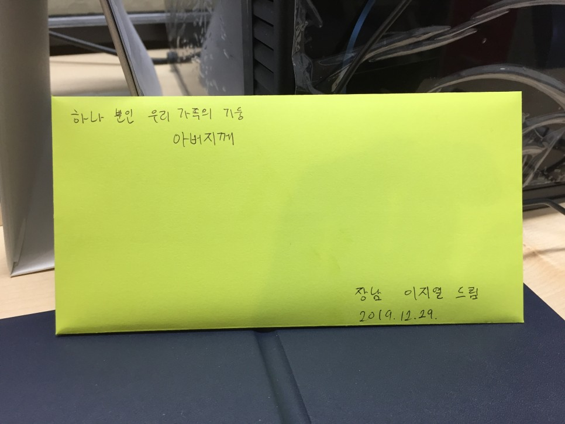

[전시회 소개 - 진심, 아버지를 읽다 글과 사진전](https://thankfather.org/introduction)

곧 정년퇴직을 하시는 아버지께 편지를 쓰기위해 편지지와 봉투를 사러 가는 길에 한 청년이 내게 말을 걸어 위 전시회에 대해 알려주었다. 평소라면 신경 쓰지 않았을지도 모르지만 아버지라는 존재에 관한 전시회이기에 한 번 가보았다. 내가 갔을 때 눈물까지 훔치고 하는 사람들은 없었지만 중간중간에 조금 눈물이 고일 뻔했다.

이 글의 제목도 '진심, 아버지를 읽다' 전시회에서 본 독일 격언이다. 아버지와 비슷한 연배 혹은 더 연세가 드신 우리 사회의 아버지들이 쓴 글이나 만든 물건들도 볼 수 있어서 좋았다.

골드스타 티비는 예전 할머니 집에 있던 티비와 거의 비슷한 제품이었고 나무로 된 옛날 빨래판도 볼 수 있었다. 아마 내가 많이 어릴 때까지만 해도 우리 집도 썼던 것 같다.

아버지께서 33년간 일하신 현대 자동차 입구에서 수많은 직원들이 출근 혹은 퇴근을 하는 흑백사진도 있었다.

조금 기다리기는 했지만 관람하는데 오래 걸리지도 않았고 훌륭한 대한민국의 여러 아버지들의 발자취와 스토리를 엿볼 수 있어서 매우 좋았다. 내가 누군가의 부모가 될지는 모르겠지만, 부모가 된다고 해도 오늘 전시회에서 접한 대단한 아버지들처럼 아버지의 역할을 해낼 수 있을까?

언제쯤 부모님의 마음을 헤아려 볼 수 있을지... 아마 내가 많이 늙게 된다고 해도 다 헤아리기는 어렵지 않을까 싶다.

아버지 정년퇴직을 기념하기 위해 어머니, 동생과 돈을 모아 특별한 피규어를 주문 제작했지만 그래도 편지를 써드리고 싶었다. 정말 오랜만에 손 편지를 써보았다. 그 오랜 기간 동안 여전히 글씨는 나아진 것이 없었지만 그래도 뿌듯했다.

*아버지께 쓴 편지의 마지막 문단*

> ***은퇴하시면 말 그대로 새로운 인생의 막이 열리게 될 것입니다. 제3의 인생으로 들어서는 만큼 이제는 자식 걱정 줄이시고 아버지 자신을 위한 인생을 잘 살아가시길 진심으로 바랍니다. 시간이 많이 흘러 아버지가 살이 많이 빠지신 것을 보면 자식으로서 안타깝기도 합니다. 건강 잘 유지하셔서 부디 오래오래 함께 계셨으면 좋겠습니다. 존경하고 감사하고 그리고 사랑합니다.***

