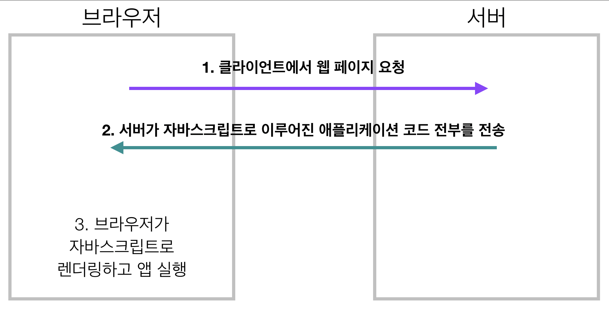

### 이 장의 목적

> Axios, Nuxt.js, VuexFire 이 세 가지 라이브러리 혹은 프레임워크에 대한 실무 지식 전달. 너무 깊게 가지는 않을 것. 이 각각의 도구들을 설명하기 위해서는 하나의 장이 필요하고, Nuxt는 책 하나의 분량이 될 수 있다.

**VuexFire는 상대적으로 중요성이 떨어진다고 판단해서 뺐습니다..

## 서버사이드 렌더링

기본적으로 리액트나 Vue와 같은 도구를 사용하면 CSR(Client-side-rendering)으로 애플리케이션이 동작한다. 그럼에도 불구하고 SSR(Server-side-rendering)이 필요한 이유가 있다.

### CSR

- 초기 로딩 속도 : 느림
    - 앱에 필요한 모든 리소스를 한 번에 처음에 받아야 하기 때문
- SEO(Search Enging Optimization) : JS로 View를 생성하기 전까지는 검색 엔진 크롤러의 데이터 수집이 제한적 ; SEO에는 불리
    - 그러나 최신 구글 봇은 자바스크립트도 지원하기 때문에 CSR로 만들어진 서비스도 SEO가 잘 된다고 듣긴 들었는데 아직 개인적으로 확인해본 사례가 있는 것은 아니다.
- 초기 로딩 이후 화면 전환 : 빠름

### SSR

- 초기 로딩 속도 : 빠름
    - 자바스크립트 데이터를 받아서 앱에 적용하기 전까지는 서비스의 기능들은 동작하지 않지만, 이는 아주 짧은 순간이고 사용자 입장에서는 매우 빠른 속도로 페이지가 로딩되었다고 생각하기 마련이다.
- SEO(Search Enging Optimization) : 유리
    - View가 서버에서 이미 렌더링되기 때문에 검색엔진 크롤러에 데이터를 수집할 수 있기 때문.
- 초기 로딩 이후 화면 전환 : 상대적으로 느림
    - 페이지 전환 시 계속 서버에 요청해야 하기 때문. 서버의 부담도 커진다.
- 새로 고침 시에 View가 먼저 그려지므로 사용자에게 View가 보여지는 딜레이가 줄어서 UX에 이점이 되는 면도 있다.
- SSR은 단순히 HTML만 서버에서 렌더링한다는 것에 그치는 것은 아니다. 다른 데이터들도 선택적으로 내려줄 수 있다.

## Nuxt.js

### 미들웨어

*Node.js와 Express에서 요청 객체와 응답 객체에 접근하는 함수를 참조할 때 쓰는 용어(책 내부에서의 정의)*

간단하게 말하면 서버에서 요청을 받고 응답을 하기 전의 단계에서 특정한 작업을 할 수 있게 해주는 것이라고 이해하면 될 것 같다.

각 미들웨어 파일은 컨텍스트 객체 접근하는 함수를 가지고 있다.

[컨텍스트 객체가 어떤 것들을 가지고 있는 보여주는 공식문서 자료]

    function (context) {
      // Universal keys
      const {
        app,
        store,
        route,
        params,
        query,
        env,
        isDev,
        isHMR,
        redirect,
        error
      } = context
      // Server-side
      if (process.server) {
        const { req, res, beforeNuxtRender } = context
      }
      // Client-side
      if (process.client) {
        const { from, nuxtState } = context
      }
    }

보통은 서버단에서 미들웨어 따로 만들어서 사용하는데 SSR을 위해서 Nuxt가 제공하는 기능이라고 이해했다.

### 라우팅

VueRouter 같은 것을 사용하는것이 아니라 pages 디렉토리 하위에 생성된 **파일 트리**로 경로가 생성된다.

파일 이름 앞에 underscore(_) 붙여서 동적 라우팅도 가능.

⇒ 둘 다 실제 책에서 제공하는 프로젝트 코드 보면서 간단히 설명!

### 슈퍼 차지 컴포넌트(pages 폴더 내 컴포넌트)

일반적인 vue 컴포넌트와 구별되는 특별한 Nuxt만을 위한 구성에 접근할 수 컴포넌트

    <template>
      <h1 class="red">Hello {{ name }}!</h1>
    </template>
    
    
    
    

**asyncData**

비동기적이고, 미들웨어와 마찬가지로 컨텍스트 객체 접근 가능

컴포넌트가 초기화되기전에 호출(서버 사이드에서)되어 컴포넌트를 불러온 데이터와 합쳐 준다.

→ 해당 컴포넌트의 data 객체와 합친다는 얘기

Vuex 스토어 사용할 필요가 없게 되면서 같은 결과를 만들어 낸다. 

→ 미들웨어와 비교해서 이점이라고 할 수 있는 점.

---

### 참고자료

- [https://hyunseob.github.io/2019/05/26/google-io-2019-day-3/](https://hyunseob.github.io/2019/05/26/google-io-2019-day-3/)
- [https://velog.io/@rjs1197/SSR과-CSR의-차이를-알아보자](https://velog.io/@rjs1197/SSR%EA%B3%BC-CSR%EC%9D%98-%EC%B0%A8%EC%9D%B4%EB%A5%BC-%EC%95%8C%EC%95%84%EB%B3%B4%EC%9E%90)