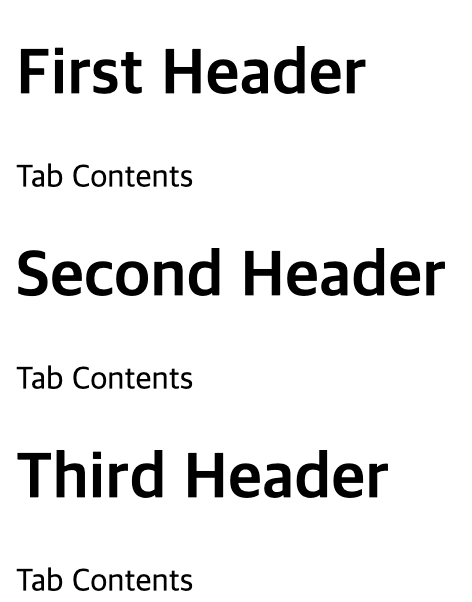

## 슬롯 사용

템플릿에 정의된 부분에서 추가적으로 컴포넌트 사용 시 태그 내에 포함된 콘텐츠도 출력하게 해주는 기능.

슬롯을 사용하면 컴포넌트의 마크업을 확장시켜줄 수 있어서 컴포넌트의 재사용성을 높여준다.

    <!-- ButtonTab.vue -->
    <template>
      

        <!-- 탭 헤더 -->
        <slot></slot>
        <!-- 탭 본문 -->
        

          Tab Contents
        

      

    </template>

    <!-- TabContainer.vue -->
    <template>
      <button-tab>
        <!-- slot 영역 -->
        <h1>First Header</h1>
      </button-tab>
      <button-tab>
        <!-- slot 영역 -->
        <h1>Second Header</h1>
      </button-tab>
      <button-tab>
        <!-- slot 영역 -->
        <h1>Third Header</h1>
      </button-tab>
    </template>
    
    

### 컴파일될 때의 범위(Compilation Scope)

아래 코드는 navigation-link 컴포넌트를 사용하는 부모 컴포넌트의 템플릿에 위치하는 코드.

부모 컴포넌트의 data 옵션에 user.name이 정의되어 있는 경우, user.name에 당연히 접근할 수 있다.

    <navigation-link url="/profile">
      Logged in as {{ user.name }}
     </navigation-link>

    <navigation-link url="/profile">
      Clicking here will send you to: {{ url }}
      <!--
      `url`은 undefined로 나온다. 이 데이터는 <navigation-link>로
      넘어가지만 부모 컴포넌트 범위에서 정의되어 있지는 않기 때문이다.
      -->
    </navigation-link>

**부모 템플릿 안에 있는 것들은 부모 컴포넌트의 범위에 컴파일되고 자식 템플릿 안에 있는 것들은 자식 컴포넌트의 범위에 컴파일됩니다.**

> v-slot 디렉티브는 slot과 slot-scope 인수들을 대체하는, 더 발전된 API로 Vue 2.6.0에 도입되었습니다. 새 문법이 도입된 이유는 이 RFC에서 찾아볼 수 있습니다. slot과 slot-scope 인수는 앞으로도 2.x 버전에서는 계속 지원될 것입니다. 하지만 Vue 3에서는 공식적으로 삭제될 예정입니다.(공식문서 내용)

**책에서는 v-slot에 대해서 다루고 있지않다. 위의 공식문서 내용처럼 앞으로 deprecated될 것들이라서 책에서 다루는 slot, slot-scope가 아니라 v-slot에 대해서만 정리하였다.**

### Named Slots(책에서는 지정 슬롯)

**base-layout이라는 컴포넌트의 템플릿**

name을 지정하지 않은 슬롯은 디폴트 슬롯이 된다.

    

      <header>
        <slot name="header"></slot>
      </header>
      <main>
        <slot></slot>
      </main>
      <footer>
        <slot name="footer"></slot>
      </footer>
    

**부모 컴포넌트에서 base-layout 컴포넌트 사용 시**

`<template>`에 v-slot 디렉티브를 쓰고 그 속성에 앞에서 지정한 ‘name’을 넣으면 이름이 있는 슬롯에 내용을 전달할 수 있다.

    <base-layout>
      <template v-slot:header>
        <h1>Here might be a page title</h1>
      </template>
    
      
A paragraph for the main content.

      
And another one.

    
      <template v-slot:footer>
        
Here's some contact info

      </template>
    </base-layout>

**아래 코드는 v-slot 지시자를 사용하지 않는 기존 문법**

꼭 template 태그를 사용하지 않고 일반 html 태그에 사용할 수 있다는 것이 차이점

    <base-layout>
      <h1 slot="header">Here might be a page title</h1>
    
      
A paragraph for the main content.

      
And another one.

    
      
Here's some contact info

    </base-layout>

v-slot 디렉티브는 슬롯이 디폴트 슬롯만 있는 경우를 제외하고 template 태그에만 사용할 수 있다.

### Scopd Slots(책에서는 범위 슬롯)

**named-scoped-slots(v-slot).html(직접 파일로 보여주기)**
책에 있는 named-scoped-slots 파일을 v-slot을 적용하여 바꾸어 보았다.

    <body>
      

        <!-- 부모 컴포넌트의 books라는 데이터를 'books'라는 이름으로 전달 -->
        <book-component v-bind:books="books">
          <template v-slot:header>
            <h1>{{header}}</h1>
          </template>
          <!-- book-component 템플릿에 정의되어 있는 슬롯 중 name이 book인 것과 연결하기 위해 v-slot 지시자 뒤에 :book을 명시. -->
          <!-- 그리고 v-slot:book="book" 이런식으로 슬롯용 template 태그 내에서 접근할 이름은 자유롭게 설정해줄 수 있다.  -->
          <template v-slot:book="bookProps">
    			<!-- BookComponent 내부 템플릿에 book이라는 name을 갖는 슬롯에서 text라는 이름으로 책 데이터가 바인딩되어 있다.
          해당 슬롯이 전달받는 모든 props는 여기서 bookProps라는 이름으로 접근 가능. -->
            <h2>
              <i>{{bookProps.text.title}}</i>
              <small>by: {{bookProps.text.author}}</small>
            </h2>
          </template>
        </book-component>
      

      
    </body>

이런 식으로 자식 컴포넌트를 슬롯을 이용해서 부모 컴포넌트에서 표현할 때, 자식 컴포넌트에 전달된 props를 부모 컴포넌트 템플릿에서 접근하여 사용할 수 있다.

## 동적 컴포넌트 사용

component 엘리먼트에 is속성을 바인딩해서 동적으로 변하는 컴포넌트를 렌더링할 수 있다.

    <component v-bind:is="currentView">
      <!-- vm.currentView가 변경되면 컴포넌트가 변경됩니다! -->
    </component>

## 비동기 컴포넌트 구현

resolve(성공), reject(실패) 콜백을 가지는 함수(일명 factory function by 공식문서)를 사용하여 비동기 컴포넌트를 만들 수 있다.

팩토리 함수의 결과 데이터는 나중에 리렌더딩되는 경우를 위해 캐싱된다.

예제에서는 간단하게 보여주기 위해 setTimeout 함수를 썼지만 팩토리 함수 내부 로직은 당연히 자유롭게 설정하면 된다.

    Vue.component("async-example", function(resolve, reject) {
      setTimeout(function() {
        // Pass the component definition to the resolve callback
        resolve({
          template: "
I am async!
"
        });
      }, 1000);
    });

**공식문서에서 추천하는 비동기 컴포넌트 사용처**

웹팩의 코드 스플리팅 구현하는 용도로 사용

    Vue.component("async-webpack-example", function(resolve) {
      // This special require syntax will instruct Webpack to
      // automatically split your built code into bundles which
      // are loaded over Ajax requests.
      require(["./my-async-component"], resolve);
    });

## Vue-CLI로 싱글 파일 컴포넌트 사용

싱글 파일 컴포넌트를 제대로 활용하려면 웹팩 같은 빌드 도구를 사용해야하고, 다양한 웹 브라우저와의 호환성을 위해 바벨 같은 도구를 사용해야할 수도 있다.

이러한 설정들을 직접 할 필요 없이 Vue-CLI를 활용하면 프로젝트 시작을 위한 기본적인 세팅들을 쉽게 할 수 있다.

## Vue Router

### 라우팅 개념 및 SPA 라우팅

[https://poiemaweb.com/js-spa](https://poiemaweb.com/js-spa)

*~~petstore 프로젝트 코드 보면서 설명 필요~~*

아래 자료는 공식문서 시작하기 첫 부분 그대로 가져온 것.

    // 0. 모듈 시스템 (예: vue-cli)을 이용하고 있다면, Vue와 Vue 라우터를 import 하세요
    // 그리고 `Vue.use(VueRouter)`를 호출하세요
    
    
    // 1. 라우트 컴포넌트를 정의하세요.
    // 아래 내용들은 다른 파일로부터 가져올 수 있습니다.
    const Foo = { template: '
foo
' }
    const Bar = { template: '
bar
' }
    
    // 2. 라우트를 정의하세요.
    // Each route should map to a component. The "component" can
    // 각 라우트는 반드시 컴포넌트와 매핑되어야 합니다.
    // "component"는 `Vue.extend()`를 통해 만들어진
    // 실제 컴포넌트 생성자이거나 컴포넌트 옵션 객체입니다.
    const routes = [
      { path: '/foo', component: Foo },
      { path: '/bar', component: Bar }
    ]
    
    // 3. `routes` 옵션과 함께 router 인스턴스를 만드세요.
    // 추가 옵션을 여기서 전달해야합니다.
    // 지금은 간단하게 유지하겠습니다.
    const router = new VueRouter({
      routes // `routes: routes`의 줄임
    })
    
    // 4. 루트 인스턴스를 만들고 mount 하세요.
    // router와 router 옵션을 전체 앱에 주입합니다.
    const app = new Vue({
      router
    }).$mount('#app')

- routes 속성 : 라우팅 할 URL과 컴포넌트
- name 속성 : 때로는 라우트에 연결하거나 탐색을 수행 할 때 이름이 있는 라우트를 사용하는 것이 더 편리
- mode 속성 : 'history'로 세팅하면 url의 해쉬값을 제거

### **router-view**

브라우저의 주소 창에서 URL이 변경되면, VueRouter 인스턴스의 routes 속성에 따라 해당 컴포넌트가 화면에 뿌려집니다. 이 때 뿌려지는 지점이 템플릿의 `<router-view>`.

    // petstore 프로젝트 App.vue 파일
    <template>
      

        <router-view/>
      

    </template>

### **router-link**

사용자들이 url을 외워서 페이지 이동할 거라고 기대할 수는 없다. 애플리케이션 안에서 각 경로에 대한 링크가 필요하다.

`<router-link>`를 사용해서 화면에서 특정 링크를 클릭해서 페이지를 이동할 수 있게 해줄 수 있다. 프로젝트 실행하면 실제로는 `<a>`태그로 변환되어 나온다.

    // '/signin', '/signup' 이런식으로 to속성에 url 삽입하여 활용
    <router-link to="이동할 URL"></router-link>

- **tag**

    tag 속성 사용하며 `<a>`가 아닌 원하는 태그로 출력되게 할 수 있다.

        <router-link tag="h1"
            :to="{name: 'Id', params: {id: product.id}}">
          {{product.title}}
        </router-link>

- **쿼리스트링 넣는 법**

    $route.query.plan 이런식으로 템플릿 내부에서 접근할 수도 있다.

        <!-- 쿼리가 있으면, `/register?plan=private` 이 됩니다. -->
        <router-link :to="{ path: 'register', query: { plan: 'private' }}">Register</router-link>

        // petstore 프로젝터 Product.vue 템플릿 
        <h1>id {{$route.params.id}} 입니다.</h1>

- **active-class**

    딱히 해당 속성을 설정하지 않아도 디폴트값으로 'router-link-active' 값이 부여된다. 해당 경로에 접속해 있을때 'router-link-active'라는 css 클래스가 해당 router-link의 태그에 세팅된다. 

    원하는 경우에 active-class라는 속성을 사용해서 'router-link-active'가 아닌 다른 css 클래스 네임을 부여할 수 있다.

- **exact-active-class**

    active-class와 동일. 그러나 exact가 붙었으니 정확하게 해당 경로로 접속했을 때만 "router-link-exact-active"라는 css 클래스가 부여된다. 아래 예제에서 Form 컴포넌트는 '/form'이라는 경로를 가진다.(아래 예제에  딱히 적어놓진 않았지만) 
    예를 들어 '/form/register' 이런식으로 /form에서 추가된 하위 경로들은 exact-active-class가 적용되지 않는다. 정확하게 '/form'에 접속했을 때에만 적용된다. 반대로 active-class의 경우에는 이러한 하위 경로들도 다 포함한다.

        <router-link
                  exact-active-class="active"
                  tag="button"
                  class="btn btn-default btn-lg"
                  :to="{name: 'Form'}"
                >
                  
        					{{cartItemCount}} 체크아웃
        </router-link>

        

### 중첩된 라우트

실제 앱 UI는 일반적으로 여러 단계로 중첩 된 컴포넌트로 이루어져 있습니다. URL의 세그먼트가 중첩 된 컴포넌트의 특정 구조와 일치한다는 것은 매우 일반적입니다. 예를 들면 다음과 같습니다.

공식문서 내용 그대로 가져와서 petstore 프로젝트 코드 보면서 설명 필요

    /user/foo/profile                     /user/foo/posts
    +------------------+                  +-----------------+
    | User             |                  | User            |
    | +--------------+ |                  | +-------------+ |
    | | Profile      | |  +------------>  | | Posts       | |
    | |              | |                  | |             | |
    | +--------------+ |                  | +-------------+ |
    +------------------+                  +-----------------+

### redirection & wildcard route

routes에 설정하지 않은 경로를 입력하여 접속할 경우에 대응하기 위한 기능

    {
      path: '*',
      redirect: '/'
    }

### Lazy Loadiing Routes

아래 공식문서 참고하는 것으로 대체

[https://router.vuejs.org/kr/guide/advanced/lazy-loading.html](https://router.vuejs.org/kr/guide/advanced/lazy-loading.html)

---

### 참고 문서

[https://kr.vuejs.org/v2/guide/components-slots.html](https://kr.vuejs.org/v2/guide/components-slots.html)

[https://kr.vuejs.org/v2/guide/components-dynamic-async.html](https://kr.vuejs.org/v2/guide/components-dynamic-async.html)

[https://joshua1988.github.io/vue-camp/vue/router.html#뷰-라우터-옵션](https://joshua1988.github.io/vue-camp/vue/router.html#%EB%B7%B0-%EB%9D%BC%EC%9A%B0%ED%84%B0-%EC%98%B5%EC%85%98)

[https://router.vuejs.org/](https://router.vuejs.org/)